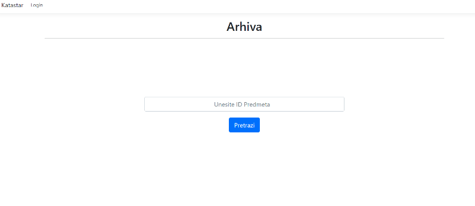
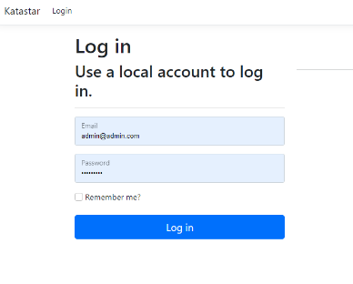

KatastarApp is designed to streamline the workflow of municipal offices responsible for property and legal affairs. It enables structured task assignment, property data management, and citizen access to parcel information — all through a clean and functional interface.
---

  

##  User Roles & Functionalities

###  Authentication
- Role-based access: **Administrator (head of office)**, **Clerks**, and **Citizens**
- Each role has distinct permissions

###  Admin / Head of Office
- Authenticated via login
- Main responsibilities:
  - Add and manage clerks
  - Enter new cases (using document ID)
  - Assign cases to clerks
  - Review and archive finished cases
  - Edit property ownership
  - Full access to case archive

###  Clerk
- Assigned by admin
- Enters new property data: location, size, and owner info
- Edits or updates assigned cases
- Marks cases as finished and sends them to the admin for review
- Access to the archive

###  Citizen
- No login required
- Can search parcel info by ID (from physical documents)
- Read-only access to ownership, location, and size details

---

##  Database & Structure

- Entity Framework Core 7 used for database interaction
- Folder `Data/` contains `ApplicationDbContext.cs` – manages DB communication
- Folder `Migrations/` – contains schema change history

---

##  Technologies Used

- **C# / .NET 7**
- **Entity Framework Core**
- **Microsoft SQL Server**
- **Windows Forms (WinForms) / WPF**
- **Visual Studio 2022**

---

##  Getting Started

###  Setup Instructions

1. Download the project
2. Open the solution in Visual Studio
3. Right-click on the solution > **Manage NuGet Packages**
4. Install **.NET 7.0.14**
5. Install **Microsoft SQL Server** and create a database named `Katastar`
6. Edit the **connection string** in `appsettings.json` (insert your SQL Server name)
7. Build and run the solution

This project was developed for academic purposes as part of university coursework. Suggestions and improvements are welcome.

